for this ---
layout: default
nav_order: 5
title: Conception et prototypage
---

# Conception et prototypage
# PUZZLEBOT — DOSSIER TECHNIQUE FINAL
## 🛠️ Dossier d'Architecture Robotique et Mécanique Clé en Main

**Statut du Projet :** `Validé et Finalisé`  
*Ce document constitue le livret de certification mécanique, électronique et optique du robot de tri automatisé **PuzzleBot** pour la soutenance finale.*

---

## 🏗️ Description Sommaire des Modules Matériels

### 1. Module : Boîtier d'Arrêt d'Urgence (STOP)
Ce module assure la sécurité immédiate de l'opérateur et de la machine par coupure matérielle directe de la puissance électrique.

* **Composants :** Coque de protection isolante et couvercle amovible configurés pour un bouton coup de poing standard.
* **Liaison OnShape :** Fixation déportée en bord de châssis pour une accessibilité optimale en cas d'anomalie.

| Aperçu Vue Clé 1 | Aperçu Vue Clé 2 |
| :---: | :---: |
| 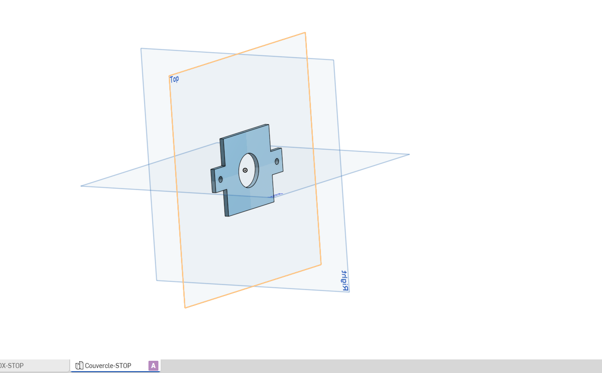 | 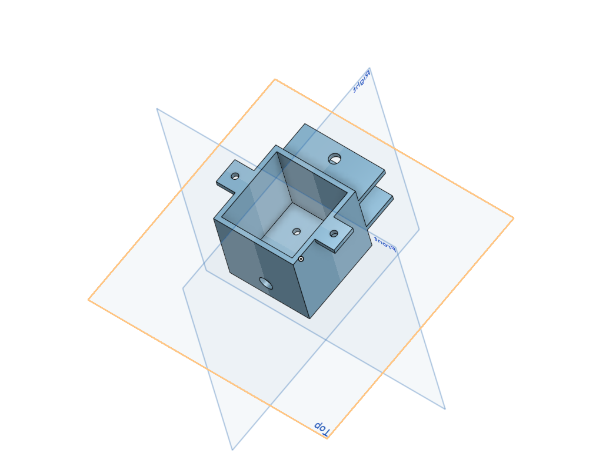 |

---

### 2. Module : Berceau de Support Électronique (Arduino)
Interface de fixation et d'isolation électrique protégeant le circuit imprimé de commande.

* **Géométrie :** Socle ajouré épousant l'empreinte de la carte, équipé de quatre bras de fixation suspendus en "L" inversé.
* **Ajustement :** Lumières oblongues intégrées pour tolérer les variations de montage sur le bâti.

| Vue de Dessus (Carte Intégrée) | Vue de Dessous (Structure Seule) |
| :---: | :---: |
| 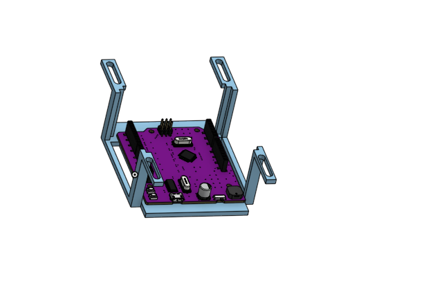 | 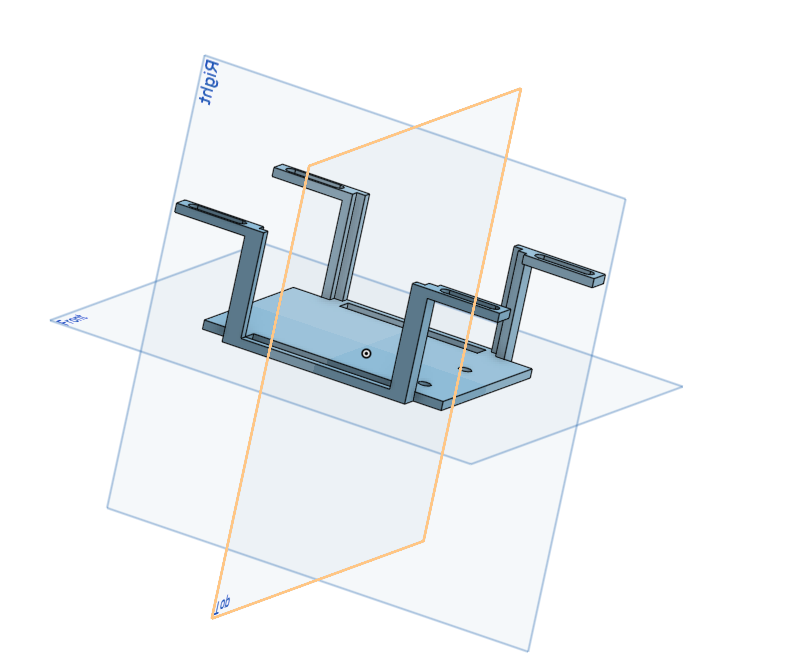 |

---

### 3. Module : Adaptateur d'Accouplement pour Servomoteur
Pièce d'accouplement direct gérant l'orientation angulaire de l'effecteur final (Axe $\theta$).

* **Transmission :** Bloc cylindrique compact bloqué radialement par une vis pointeau pour interdire tout glissement sous charge.
* **Sécurité :** Conçu pour faire office de fusible mécanique et rompre avant les pignons internes du servomoteur en cas de collision.

  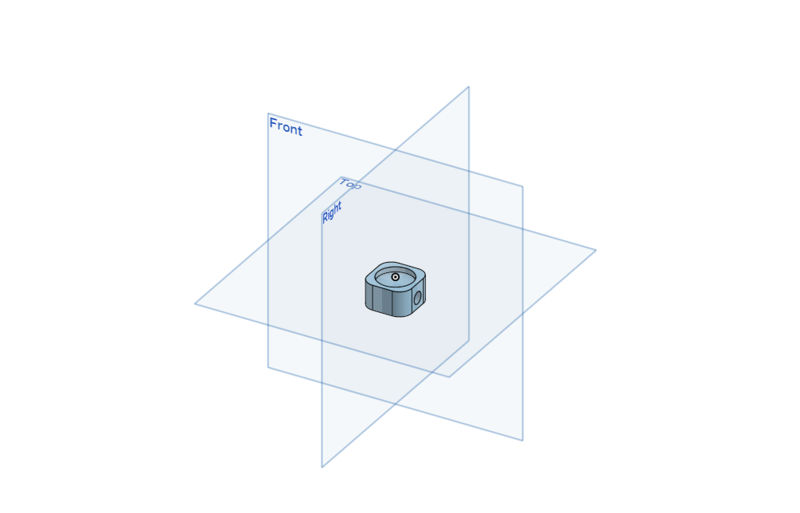

---

### 4. Module : Système d'Actionnement Vertical et Guidage (Pignon-Crémaillère)
Mécanisme robuste assurant la translation linéaire verticale de la tête de préhension (Axe Z).

* **Cinématique :** Conversion du mouvement rotatif par un engrènement pignon-crémaillère droit assurant un positionnement sans élongation.
* **Guidage :** Double glissière enveloppante en "U" empêchant l'arc-boutement et les flexions structurales.

| Pignon Droit | Crémaillère Mobile | Glissières de Guidage en U |
| :---: | :---: | :---: |
| 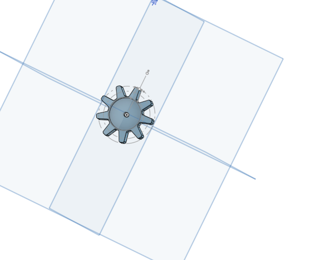 | 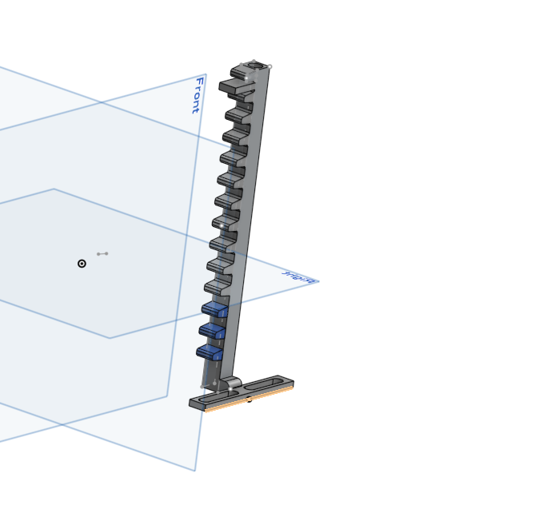 | 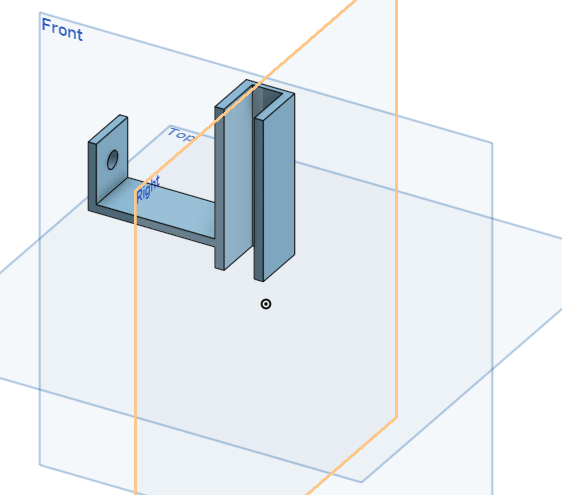 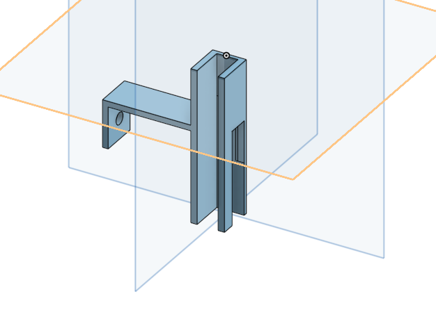 |

---

### 5. Module : Boîtier d'Intégration Pneumatique (Pompe & Électrovanne)
Centrale de gestion de dépression pour la préhension des pièces de puzzle par effet ventouse.

* **Intégration :** Cavité cylindrique ventilée dédiée à la mini-pompe à vide couplée à un logement pour l'électrovanne de décharge.
* **Avantage :** Réduction maximale des longueurs de tuyaux pour éliminer les pertes de charge et garantir un relâchement instantané.

  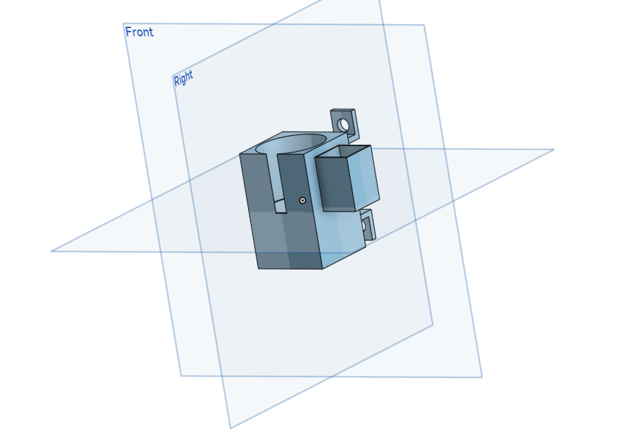

---

### 6. Module : Chariot de Tête Mobile et Effecteur Terminal
Équipage mobile principal regroupant l'ensemble des fonctionnalités de manipulation.

* **Guidage horizontal :** Platine à trois galets à gorge assurant un appui isostatique parfait sur le rail.
* **Entraînement :** Support de motorisation pas-à-pas avec poulie crantée pour la translation autonome (Axe X/Y).

| Face Avant (Effecteur & Z) | Face Arrière (Moteur & Galets) |
| :---: | :---: |
| 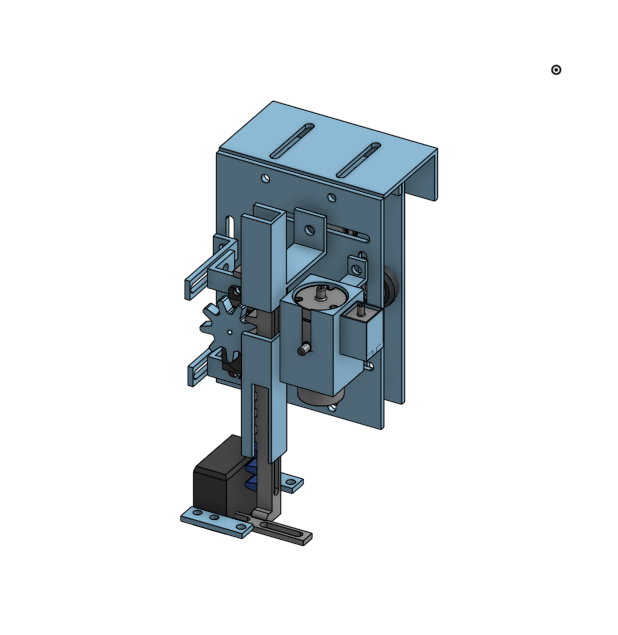 | 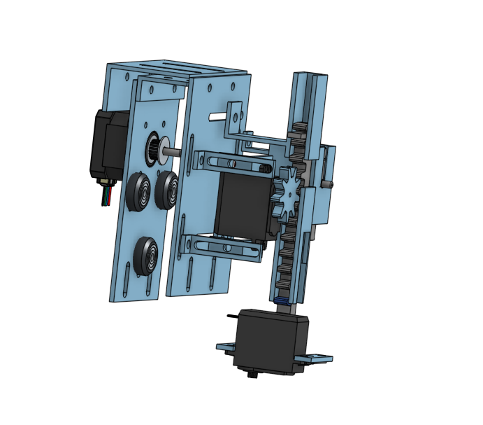 |

---

### 7. Module : Supports d'Ancrage et Fixation de Profilé Suspendu
Éléments d'extrémité fixes maintenant l'axe linéaire principal au-dessus de l'aire de travail.

* **Structure :** Platines d'équerre pliées à 90° avec empreintes d'écrous hexagonaux noyés pour un serrage propre d'une seule main.
* **Réglage :** Lumières oblongues supérieures pour calibrer le parallélisme rigoureux du profilé de guidage.

  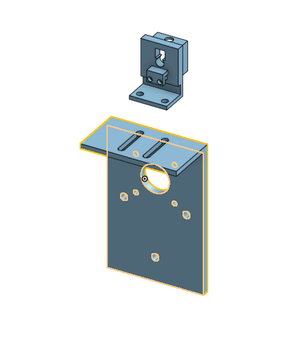

---

### 8. Module : Support de Capteur Fin de Course (Butée Électromécanique)
Interface de sécurité et de calibration de l'origine machine (*Homing*).

* **Ajustabilité :** Support coulissant à positionnement variable fixé directement dans la rainure du profilé d'aluminium par un écrou en T.
* **Sécurité :** Interrompt la puissance des moteurs en cas de dépassement de course pour préserver la mécanique.

  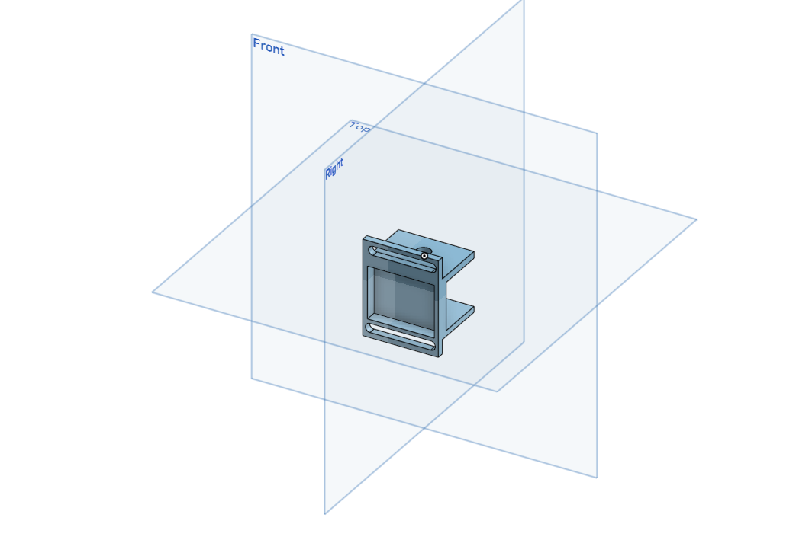

---

### 9. Portique de Vision : Équerres et Raccords de Profilés en T
Kit de pièces d'interconnexion rigides pour l'ossature suspendue du système de vision.

* **Composants :** Équerres renforcées à 90°, manchons d'alignement et cube de jonction terminal creux.
* **Stabilité :** Élimine les micro-oscillations structurelles afin de garantir la netteté et la répétabilité des captures d'image.

| Équerre Renforcée | Manchon d'Alignement | Cube de Jonction |
| :---: | :---: | :---: |
| 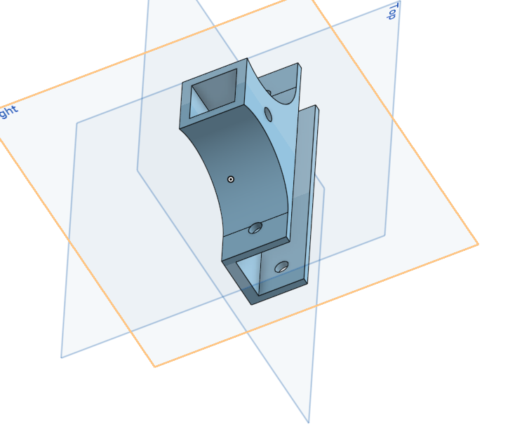 | 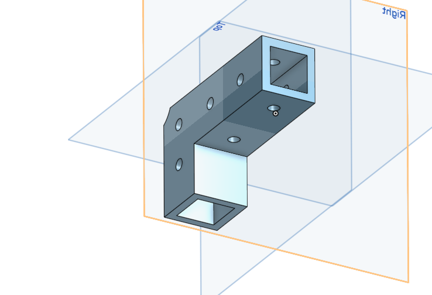 | 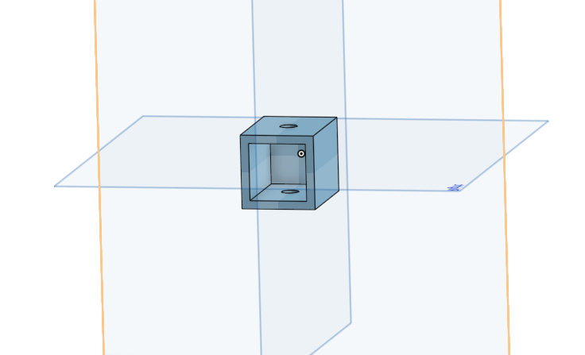 |

---

### 10. Module : Boîtier et Couvercle de Caméra de Vision
Enveloppe hermétique protégeant l'œil optique du robot.

* **Design :** Logement sur mesure avec perçage inférieur pour l'objectif et couvercle amovible pour le passage propre de la nappe de données.
* **Alignement :** Fixation rigide en bout de portique pour maintenir un axe optique parfaitement vertical (zénithal).

| Corps du Boîtier | Couvercle Supérieur |
| :---: | :---: |
| 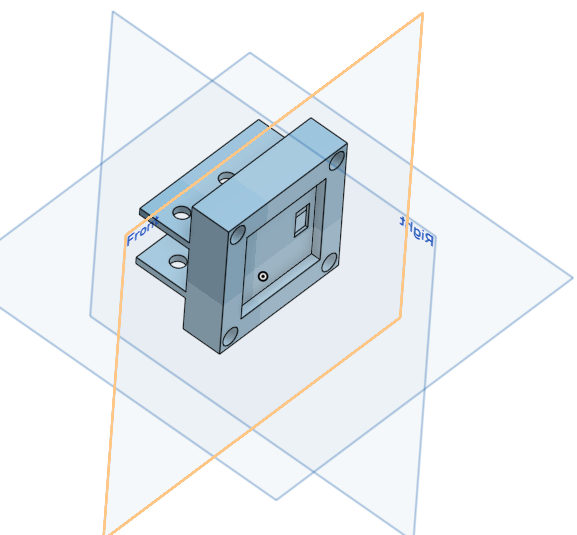 | 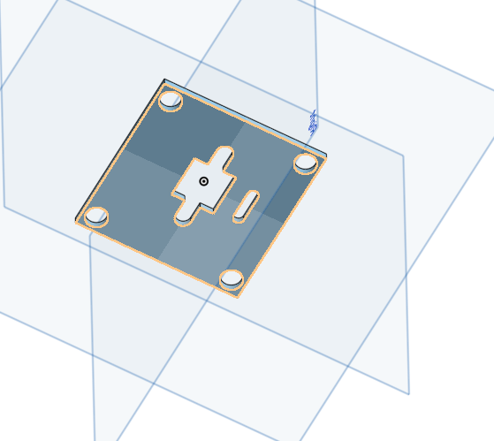 |

---

## 🔄 11. Assemblage Général : Système Portique Intégré (Gantry Assembly)

Le **PuzzleBot** se caractérise par une architecture en portique suspendu à trois axes numériques coordonnés.

### 🧠 Synthèse Fonctionnelle du Cycle de Tri
1. **Cartographie :** Le système de vision cartographie le plateau de jeu et transmet les coordonnées spatiales et l'orientation des pièces à l'Arduino.
2. **Approche :** L'axe linéaire principal déplace horizontalement le chariot de tête mobile jusqu'à l'aplomb de la cible.
3. **Descente & Saisie :** L'axe Z descend la crémaillère pour appliquer la ventouse sur la pièce tandis que la pompe crée le vide.
4. **Correction Spatiale :** Pendant le transfert vers la zone de dépose, l'accouplement du servomoteur effectue la correction angulaire précise de la pièce.
5. **Dépose :** L'électrovanne casse le vide instantanément pour positionner la pièce à son emplacement final.

  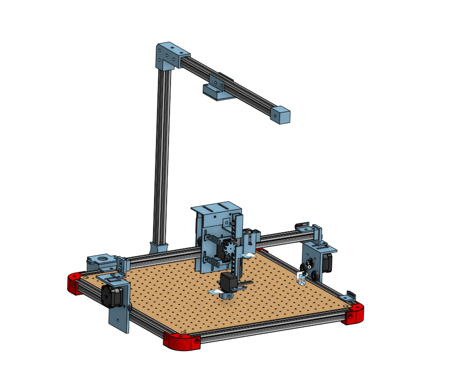

