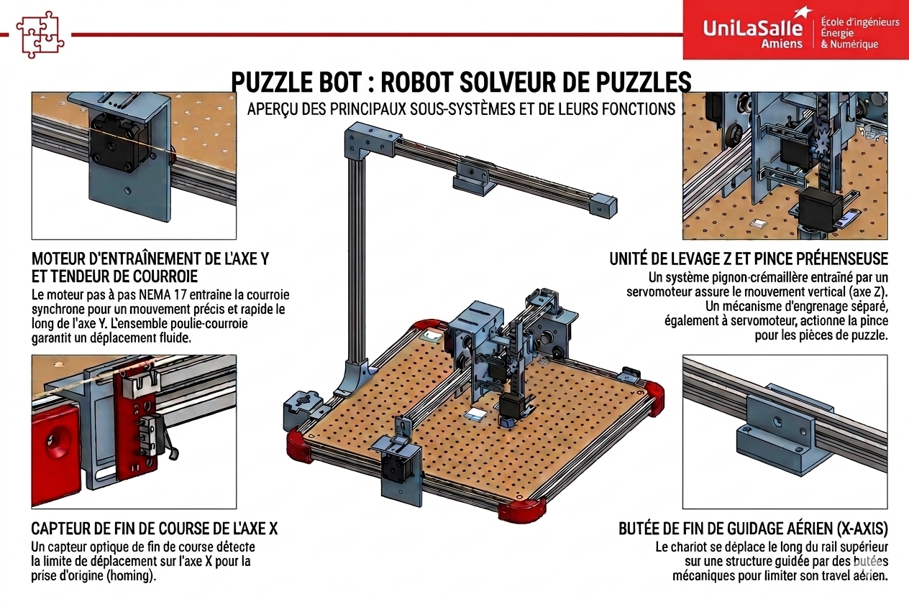

# 🤖 Projet : PUZZLE-BOT

Bienvenue sur la plateforme officielle de documentation de notre **PuzzleBot**. Cet espace rassemble l'intégralité de nos travaux, de notre code et de nos modèles mécaniques afin de vous permettre de comprendre l'architecture du système ou de reproduire la machine chez vous.

*Note de l'équipe : Cette documentation a été entièrement rédigée par nos soins, avec nos propres mots et notre ressenti de terrain (sans génération automatique de texte). Si quelques coquilles ou fautes d'orthographe se sont glissées au fil des pages, nous sollicitons votre indulgence ! Bonne exploration !!!*

---

## 🎯 Le Concept en quelques mots
Le **PuzzleBot** est une machine cartésienne automatisée conçue pour analyser un espace de jeu, identifier des pièces géométriques éparpillées, calculer leur orientation et les assembler de manière 100 % autonome grâce à un système embarqué couplé à une intelligence artificielle de vision 2D.

[Accéder au Modèle OnShape](hhttps://cad.onshape.com/documents/84e88f4e375eb4ed6fb94771/w/f35ce4c2f78cc824098f0191/e/25b35cf47e563bc8a74c1f47){: .btn .btn-primary .fs-5 .mb-4 .mb-md-0 .mr-2 }
[Explorer le Dépôt GitHub](https://github.com/Makerspace-Amiens-2025-26/Puzzle-Bot-Groupe04){: .btn .fs-5 .mb-4 .mb-md-0 }

---

## 🔍 Origine et Contexte du Projet

### 💡 Notre Inspiration
Sur le plan mécanique et cinématique, la structure globale de notre robot s'inspire directement du design et du châssis des machines à commande numérique open-source de type **Shapeoko CNC**. Nous avons repris cette architecture de portique mobile robuste à deux axes (X, Y) guidés par des rails profilés pour l'adapter aux exigences de vitesse et de répétabilité d'un cycle industriel de manipulation de type *Pick & Place*.

### 🎓 Cadre Académique
Ce projet s'inscrit dans le cadre de notre cursus d'ingénieur en informatique et technologies innovantes à **UniLaSalle Amiens**. Bien qu'il réponde à un cahier des charges académique strict (alliant vision par ordinateur, métrologie et mécanique de précision), nous avons conçu ce robot comme un projet ouvert et ludique. Quiconque dispose du matériel requis, de composants imprimés en 3D et d'un peu de patience peut s'en inspirer pour concevoir sa propre version.

## Poster

## Vidéo

Ici vous publierez la vidéo de votre projet. 
- 1min30 au format vertical
- Présentation du projet 
- Des explication du fonctionnement du projet
- Des vues du projet / Prototype / Application etc... 
- Des plans du fonctionnement (même basique ou des éléments séparés)
- Une conclusion
- Si en stockage local : <50mo

---
